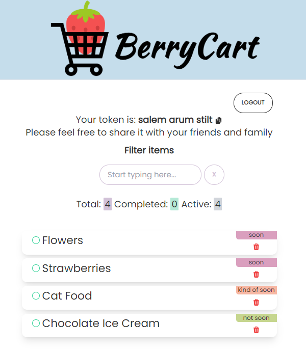

# BerryCart: Your Personalized Shopping List

Welcome to BerryCart, the app designed to simplify and personalize your grocery shopping experience!
<br>Say goodbye to traditional shopping lists and hello to smart, adaptive shopping with BerryCart. 🍓

Live Site: [BerryCart Shopping List](https://tcl-63-smart-shopping-list.web.app/list)



## Features

- **One-Stop Management**: Keep all your grocery items organized in one app, eliminating the need for paper lists or multiple apps. With BerryCart, every shopping list is unique. Create separate lists for different needs or people, each with its own three-word token

- **Smart Estimations**: The more you use BerryCart, the smarter it gets. It learns your purchasing habits and frequency, estimating when you're likely to buy an item again, ensuring you never run out of your essentials.
- **Built with Accessibility in Mind**: Our user interface is designed with clear contrasts and screen-reader compatibility. Voice-over functionalities and keyboard navigation ensure that BerryCart is easily navigable for users with visual or motor impairments.

## Getting Started

1. **Creating a List**: Launch BerryCart and tap on 'Create New List' to start fresh or enter your three-word token to dive into an existing list.

2. **Add Items**: Tap on 'Add Item', input the item's name, and set its purchasing frequency.

3. **Check Off with a Tap**: Bought an item? Simply check it off the list.

## Technologies

| 🖥           | 🔧                                                                                                                                                                                                                                                                                                                                      |
| ------------ | --------------------------------------------------------------------------------------------------------------------------------------------------------------------------------------------------------------------------------------------------------------------------------------------------------------------------------------- |
| Frontend     |                                                                                                                                                                                                                            |
| Backend      |                                                                                                                       |
| UI/UX Design |    |
| Libraries    |         |

## Instructions:

If you want to run this project on your local computer, follow these steps:

1. Clone the repo:

```
git clone https://github.com/the-collab-lab/tcl-63-smart-shopping-list.git
```

2. Navigate to the project directory:

```
cd tcl-63-smart-shopping-list
```

3. Install the dependencies:

```
npm install
```

4. Start the development server:

```
npm start
```

## Developer Team

- [Shangguan Wang](https://github.com/shangguanwang) 🌉
- [Raquel Pfeifle](https://github.com/rdpfeifle) 🌄
- [Corina Murg](https://github.com/CorinaMurg) 🐳
- [Aslan Taheri](https://github.com/AslanTaheri) 🦁

## Mentors

- [Devin Jaggernauth](https://github.com/mentalcaries) 👻
- [Caitlin Floyd](https://github.com/cafloyd) 🌸
- [Chase Wright](https://github.com/chase-cove) 🐱
- [Julia Undeutsch](https://github.com/YuriDevAT) 🤓
